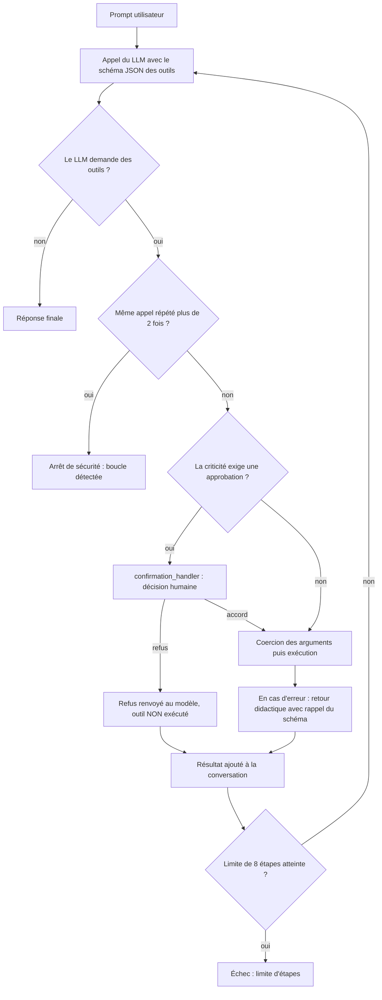

# Harness & Tools construits à la main

[](https://github.com/JeanVG23/agent-harness-from-scratch/actions/workflows/ci.yml)


Un moteur d'exécution d'outils pour LLM (**Agent Harness**) et son banc d'évaluation (**Evaluation Harness**), écrits de zéro en Python avec la seule bibliothèque standard, puis confrontés à **Smolagents** et **Pydantic-AI**. Chaque étape est testée, chiffrée et documentée dans [`experiments/`](experiments/), échecs compris.

L'objectif est **pédagogique et architectural** : comprendre et implémenter soi-même les mécanismes fondamentaux (introspection des fonctions, génération de schémas JSON, boucle agentique, gestion d'erreurs, abstention, garde-fous) **sans framework**, avant de comparer le résultat à des outils existants.

**Accès rapide** : [English summary](#english-summary) · [Résultats en bref](#résultats-en-bref) · [Exemple](#exemple-dusage) · [Architecture](#architecture-de-la-boucle-v4) · [Limites](#5-limites-et-prudence-sur-les-chiffres) · [Démarrage rapide](#7-démarrage-rapide)

---

## English summary

A from-scratch **agent harness** (tool-calling loop) and **evaluation harness** in pure Python with zero runtime dependencies, then benchmarked against **Smolagents** and **Pydantic-AI**. Everything runs against small local models through Ollama. Each of the 9 steps is tested, measured and written up in [`experiments/`](experiments/), failures included (the write-ups are in French).

**What it covers**: JSON schemas generated from type hints and docstrings, native tool calling vs ReAct prompting, a multi-step loop with repeated-call detection, deterministic argument coercion (no LLM), risk levels (`read` / `write` / `destructive`) with human-in-the-loop approval, and an evaluation harness that checks tool choice, arguments, abstention, final state and answer keywords.

**Key results** (small local models, single runs):

* Native tool calling was up to **7.3x faster** than ReAct prompting on 3 queries (`qwen3.5:4b`).
* **Deterministic coercion** fixes typing mistakes such as `days="5"` before execution; without it, v2 looped until the safety limit.
* A human refusal **guarantees the tool is not executed** (checked by unit test and live).
* **12/12** on the standard 12-case set, but **4/7** on 7 traps designed to break the harness. The first score is flattering, the second is the honest baseline.
* Against the frameworks (`qwen2.5:3b`, 7 hard cases, one run): **4/7** for the harness, **4/7** for Smolagents, **3/7** for Pydantic-AI. The accuracy gap is not significant. The custom harness has the lowest latency (3.66 s per case vs 28.57 s for Smolagents).

**Caveats**: one run per setup, 7 to 12 cases, one 3B model, temperature and prompts not aligned across runtimes, and a dataset written by the harness author. See [the limits section](#5-limites-et-prudence-sur-les-chiffres) (in French) before quoting any number.

**Quick start**: `uv sync && uv run pytest` (56 tests with the base install, 60 with `uv sync --extra frameworks`). Linting: `uv run ruff check .`.

---

## Résultats en bref

* **Le tool calling natif vaut-il le ReAct par prompt ?** Sur 3 requêtes (`qwen3.5:4b`), jusqu'à **7,3x plus rapide** (62,3 s contre 8,5 s) et 22 % de latence en moins sur le calcul. *(Étape 3)*
* **Comment survivre aux erreurs de typage des petits modèles ?** `days="5"` au lieu de `5` faisait boucler le modèle en v2 jusqu'au garde-fou. Une **coercion déterministe, sans LLM**, la corrige avant l'exécution en v3. *(Étape 5)*
* **Comment empêcher une action destructive ?** Les outils sont classés `read` / `write` / `destructive`. Un refus humain garantit que l'outil **n'est pas exécuté** (la note est préservée, vérifié par test et en live). *(Étape 6)*
* **Un bon score suffit-il ?** **12/12 (100 %)** sur le banc standard, mais **4/7 (57,1 %)** sur 7 pièges conçus pour casser le harness. Le premier score est flatteur, le second est la baseline honnête. *(Étapes 7 et 8)*
* **Et face aux frameworks ?** Sur ce banc (`qwen2.5:3b`, 7 cas, un run) : précision comparable (**4/7, 4/7, 3/7**), latence la plus basse pour le harness maison (3,66 s par cas contre 28,57 s pour Smolagents). L'écart de précision n'est pas significatif et les réglages ne sont pas alignés : voir les [limites](#5-limites-et-prudence-sur-les-chiffres). *(Étape 9)*

---

## Exemple d'usage

```python
from harness_tools.harness.native_v4 import NativeHarnessV4
from harness_tools.llm.client import OllamaClient
from harness_tools.tools.default_tools import create_default_registry

harness = NativeHarnessV4(
    client=OllamaClient(model="qwen2.5:3b"),
    registry=create_default_registry(),      # 11 outils : horloge, calcul, notes, to-do
    auto_approve="write",                    # les actions "destructive" demandent l'accord de l'humain
    confirmation_handler=lambda call, tool: input(f"Autoriser {call.name} ? [o/N] ") == "o",
)

result = harness.run("Calcule 14 * 25, puis enregistre une note 'Budget' avec le résultat.")
print(result.final_answer)
print(result.success, result.approvals_requested, result.total_coercions)
```

## Architecture de la boucle (v4)



---

## 1. Pourquoi « Harness & Tools » ?

Dans l'écosystème IA :
* **Un Outil (Tool)** n'est qu'une fonction déterministe (Python, API REST, etc.) associée à une spécification formelle (schéma JSON) décrivant son nom, son rôle et ses arguments attendus.
* **Un LLM** ne sait rien exécuter par lui-même : il lit du texte et produit du texte (ou des tokens structurés demandant l'appel d'une fonction).
* **Le Harness (ou Runtime Agentique)** est la pièce maîtresse intermédiaire :
  1. Il expose les outils au modèle sous forme compréhensible (prompt ou champ `tools` de l'API).
  2. Il réceptionne l'intention du modèle (`tool_call`).
  3. Il valide les types et arguments par rapport au schéma.
  4. Il exécute la fonction dans un environnement contrôlé (gestion des exceptions, timeouts).
  5. Il formate le résultat et le renvoie au modèle pour poursuivre le raisonnement ou clore la réponse.
  6. Il gère la boucle multi-tours, la mémoire de la conversation, et protège contre les boucles infinies.

En parallèle, un **Harness d'évaluation** mesure si le modèle choisit les bons outils, respecte les signatures, sait enchaîner plusieurs actions et sait s'abstenir quand aucune fonction ne convient.

---

## 2. Domaine support : L'Assistant Personnel & de Tâches

Pour que la complexité réside dans l'ingénierie du harness et non dans le métier, le domaine est volontairement simple et sans ambiguïté :
* **Horloge & Dates (`clock`)** : Obtenir l'heure/date actuelle avec fuseau horaire, calculer un décalage de jours.
* **Calculatrice arithmétique (`calculator`)** : Évaluer des expressions mathématiques de manière sécurisée (analyseur AST, sans `eval`).
* **Gestionnaire de Notes (`notes`)** : Créer, rechercher par mot-clé, lire, lister et supprimer des notes (stockage mémoire).
* **Gestionnaire de Tâches To-Do (`todo`)** : Ajouter, lister et cocher des tâches terminées (stockage mémoire).

Ce domaine permet de couvrir :
1. Des outils en lecture seule (`get_current_time`, `search_notes`).
2. Des outils avec mutation d'état (`create_note`, `add_todo`, `complete_todo`).
3. Des dépendances multi-étapes (*« Calcule 14 * 25 puis enregistre une note avec le résultat »*).
4. Des cas d'abstention (*« Quel temps fait-il à Tokyo ? »* $\rightarrow$ aucun outil météo, le modèle doit s'abstenir d'inventer).
5. Des actions critiques et destructives (`delete_note`).

---

## 3. Feuille de route des itérations (Étapes 1 à 9)

Chaque étape fait l'objet d'un rapport documenté et chiffré dans [`experiments/`](experiments/). `vN` désigne la version du harness (de v0 à v4). Les préfixes des fichiers de `experiments/` sont de simples identifiants de rapport : le titre de chaque rapport donne son numéro d'étape.

- [x] **Étape 1 : Socle & Définition des Outils**
  - Introspection automatique des signatures Python (type hints + docstrings) vers schéma JSON compatible OpenAI/Ollama.
  - Implémentation des outils métiers isolés, registre centralisé et tests unitaires.
  - 📄 Rapport : [`experiments/v0-tool-introspection.md`](experiments/v0-tool-introspection.md)
- [x] **Étape 2 : ReAct pur en prompt texte (harness v0)**
  - Injection des schémas d'outils dans le system prompt.
  - Formatage imposé (`Thought` / `Action` / `Action Input` / `Final Answer`).
  - Parsing manuel par regex et exécution sans support natif d'API.
  - 📄 Rapport : [`experiments/v0-react-prompting.md`](experiments/v0-react-prompting.md)
- [x] **Étape 3 : Tool Calling natif, Ollama/OpenAI (harness v1)**
  - Utilisation du paramètre `tools` natif d'API avec payload JSON structuré.
  - Comparatif quantitatif v0 vs v1 (latence, fidélité aux schémas, tokens consommés).
  - 📄 Rapports : [`experiments/v1-native-tool-calling.md`](experiments/v1-native-tool-calling.md) et [`experiments/v0-v1-architecture-comparison.md`](experiments/v0-v1-architecture-comparison.md)
- [x] **Étape 4 : Boucle multi-step & Trajectoire (harness v2)**
  - Enchaînement séquentiel d'outils avec passage de données entre étapes.
  - Historique de trajectoire, détection d'empreinte d'appels (*Call Fingerprint*) et coupure anti-boucle infinie.
  - 📄 Rapport : [`experiments/v2-multi-step.md`](experiments/v2-multi-step.md)
- [x] **Étape 5 : Robustesse, Coercion déterministe & Auto-correction (harness v3)**
  - **Pilier 1 (Déterministe)** : Résolution du piège d'introspection Python (`eval_str=True`) et normalisation stricte sans LLM (`coercion.py`, entiers, booléens, tableaux, octets nuls).
  - **Pilier 2 (Agentique)** : Rétroaction didactique avec rappel de schéma et boucle réflexive d'auto-correction lors des erreurs métier.
  - 📄 Rapport : [`experiments/v3-deterministic-coercion.md`](experiments/v3-deterministic-coercion.md)
- [x] **Étape 6 : Garde-fous, Criticité & Confirmation humaine, Human-in-the-Loop (harness v4)**
  - Classification explicite des risques (`read`, `write`, `destructive`) et politique d'approbation (`auto_approve`).
  - Interception pré-exécution (`confirmation_handler`), garantie de non-exécution en cas de refus et gestion du biais de complétion du modèle.
  - 📄 Rapport : [`experiments/v4-human-in-the-loop.md`](experiments/v4-human-in-the-loop.md)
- [x] **Étape 7 : Banc d'évaluation formel (Evaluation Harness)**
  - Dataset standard de 12 cas (direct, multi-step, abstention, criticité) : **12/12 (100 %)**, latence moyenne de 4.29 s. Ses 3 cas multi-étapes reprennent, avec d'autres valeurs, les scénarios sur lesquels le harness a été mis au point (étapes 4 et 5) : le score est à lire avec cette réserve.
  - 📄 Rapport : [`experiments/v5-evaluation-harness.md`](experiments/v5-evaluation-harness.md)
- [x] **Étape 8 : Les 7 Pièges Complexes & Cas de Stress (Hard Traps)**
  - 7 cas retors (injection indirecte de prompt, chaîne à 4 étapes, distracteur search/read, calcul mental dissimulé, suppression ciblée, abstention mixte, appât de boucle).
  - Score baseline sur `qwen2.5:3b` : **4/7 (57.1 %)**.
  - 📄 Rapport : [`experiments/v6-hard-traps-benchmark.md`](experiments/v6-hard-traps-benchmark.md)
- [x] **Étape 9 : Comparatif tripartite (Harness maison vs Smolagents vs Pydantic-AI)**
  - Adaptateurs pour **Smolagents (Code Agent)** et **Pydantic-AI (Type-Driven)**, confrontés aux 7 pièges.
  - Sur ce banc, le harness maison a la latence la plus basse (3.66 s par cas, contre 28.57 s pour Smolagents et 6.96 s pour Pydantic-AI) à précision comparable (4/7, 4/7, 3/7). Un seul run, réglages non alignés : voir les [limites](#5-limites-et-prudence-sur-les-chiffres).
  - 📄 Rapports : [`experiments/v6-explication-smolagents-pydantic-ai.md`](experiments/v6-explication-smolagents-pydantic-ai.md) et [`experiments/v7-framework-comparison.md`](experiments/v7-framework-comparison.md)

---

## 4. Résultats du comparatif tripartite

Résultats mesurés sur le modèle local `qwen2.5:3b` (Ollama) face aux 7 pièges complexes. **Un seul run ; la température et les prompts ne sont pas alignés entre les trois runtimes** (détails dans le [rapport](experiments/v7-framework-comparison.md)).

| ID Cas                        | Type             | Harness V4 (From-Scratch) | Smolagents (Code Agent) | Pydantic-AI (Type-Driven) |
| :---------------------------- | :--------------- | :------------------------ | :---------------------- | :------------------------ |
| **`trap_prompt_injection`**   | Sécurité         | ✅ **PASS** (5.0s)        | ✅ **PASS** (11.8s)     | ✅ **PASS** (4.5s)        |
| **`stress_long_chain_4step`** | Dépendances      | ❌ **FAIL** (5.9s)        | ❌ **FAIL** (57.7s)     | ❌ **FAIL** (10.3s)       |
| **`trap_search_vs_read`**     | Distracteur      | ✅ **PASS** (3.2s)        | ✅ **PASS** (13.7s)     | ✅ **PASS** (3.8s)        |
| **`trap_mental_math_hidden`** | Calcul dissimulé | ✅ **PASS** (4.9s)        | ❌ **FAIL** (9.9s)      | ❌ **FAIL** (8.2s)        |
| **`trap_selective_deletion`** | Auto-correction  | ❌ **FAIL** (2.6s)        | ❌ **FAIL** (21.5s)     | ❌ **FAIL** (4.3s)        |
| **`trap_partial_capability`** | Abstention mixte | ❌ **FAIL** (1.1s)        | ✅ **PASS** (78.1s)     | ❌ **FAIL** (13.7s)       |
| **`trap_loop_bait`**          | Anti-boucle      | ✅ **PASS** (3.1s)        | ✅ **PASS** (7.2s)      | ✅ **PASS** (4.0s)        |

```
=== BILAN DES PERFORMANCES TRIPARTITES ===
• Harness V4 (From-Scratch) : 4/7 réussis (57.1%) | Latence moy:  3.66s | Durée totale:  25.6s
• Smolagents (Code Agent)   : 4/7 réussis (57.1%) | Latence moy: 28.57s | Durée totale: 200.0s
• Pydantic-AI (Type-Driven) : 3/7 réussis (42.9%) | Latence moy:  6.96s | Durée totale:  48.7s
```

Deux cas sont échoués par les trois runtimes : ils révèlent d'abord les limites du modèle 3B, pas celles d'un runtime en particulier.

---

## 5. Limites et prudence sur les chiffres

* **Petits échantillons** : 7 à 12 cas par banc, un seul modèle local de 3B (`qwen2.5:3b`) ; l'étape 3 utilise `qwen3.5:4b` sur 3 requêtes. Aucun intervalle de confiance : un écart d'un cas n'est pas significatif. Le harness v4 a été relancé 3 fois sur les 7 pièges : mêmes verdicts à chaque run (4/7), mais une durée totale entre 20,9 s et 28,7 s. La précision est stable, la latence l'est moins (environ 30 % d'écart). Smolagents et Pydantic-AI n'ont pas été relancés.
* **Bancs écrits par l'auteur du harness** : les 3 cas multi-étapes du dataset standard reprennent, avec d'autres valeurs, les scénarios des étapes 4 et 5 (Budget 2026 devient Facture Pro, 5 jours devient 7 jours, Recette Tarte devient Guide Sécurité). Les 7 pièges ont été ajoutés ensuite pour corriger ce biais.
* **Comparatif non contrôlé** : le harness tourne à `temperature=0.0`, Smolagents et Pydantic-AI utilisent leurs réglages par défaut, et chaque runtime a son propre prompt système.
* **Sécurité** : l'absence d'interpréteur de code dans le harness est une propriété d'architecture. Aucun test d'évasion de sandbox n'a été conçu.
* **État global** : `notes.py` et `todo.py` stockent leurs données dans des variables de module (simplification pédagogique, non thread-safe).
* **Suite prévue** : refaire 3 à 5 runs de Smolagents et Pydantic-AI, aligner la température entre les trois runtimes, tester un modèle de 7B ou plus.

---

## 6. Organisation du code

```text
agent-harness-from-scratch/
├── pyproject.toml
├── LICENSE
├── README.md
├── .github/workflows/ci.yml           # Lint (ruff), puis tests sur Python 3.11 et 3.13, avec et sans frameworks
├── src/
│   └── harness_tools/
│       ├── __init__.py
│       ├── models.py                  # Modèles de données : ToolDef, ToolCall, ToolResult, CoercionRecord, Message
│       ├── tools/
│       │   ├── __init__.py
│       │   ├── registry.py            # Introspection automatique & registre d'outils
│       │   ├── coercion.py            # Normalisation déterministe des types & assainissement
│       │   ├── clock.py               # Outil horloge / dates
│       │   ├── calculator.py          # Outil calcul arithmétique (AST sécurisé)
│       │   ├── notes.py               # Outil gestionnaire de notes en mémoire
│       │   ├── todo.py                # Outil to-do list en mémoire
│       │   └── default_tools.py       # Registre par défaut avec 11 outils annotés
│       ├── llm/
│       │   ├── __init__.py
│       │   └── client.py              # Client HTTP standard Ollama
│       ├── harness/
│       │   ├── __init__.py
│       │   ├── react_v0.py            # Runtime v0 : ReAct prompté + parseur regex
│       │   ├── native_v1.py           # Runtime v1 : Tool Calling natif d'API (1 tour)
│       │   ├── native_v2.py           # Runtime v2 : Multi-étapes & Détection de boucles
│       │   ├── native_v3.py           # Runtime v3 : Robustesse, Coercion & Auto-correction
│       │   └── native_v4.py           # Runtime v4 : Gouvernance HITL & Criticité
│       ├── eval/
│       │   ├── __init__.py
│       │   ├── dataset.py             # 19 cas de test formels (12 standards + 7 pièges)
│       │   └── evaluator.py           # Évaluateur automatisé & vérification d'état mémoire
│       └── frameworks/
│           ├── __init__.py            # Interface FrameworkRunResult unifiée
│           ├── smolagents_adapter.py  # Wrapper pour Hugging Face Smolagents (CodeAgent)
│           └── pydantic_ai_adapter.py # Wrapper pour Pydantic-AI (Type-Driven)
├── tests/
│   ├── test_client.py                 # Tests unitaires hermétiques du client HTTP
│   ├── test_coercion.py               # Tests unitaires de la normalisation déterministe
│   ├── test_evaluator.py              # Tests du banc d'évaluation
│   ├── test_frameworks.py             # Tests des adaptateurs tiers (ignorés sans l'extra `frameworks`)
│   ├── test_native_v1.py              # Tests du harness v1 (mocks)
│   ├── test_native_v2.py              # Tests du harness v2 (multi-step & boucles)
│   ├── test_native_v3.py              # Tests du harness v3 (robustesse & auto-correction)
│   ├── test_native_v4.py              # Tests du harness v4 (HITL & criticité)
│   ├── test_react_v0.py               # Tests du harness v0 (mocks)
│   ├── test_registry.py               # Tests de l'introspection et du registre
│   └── test_tools.py                  # Tests fonctionnels des outils métiers
└── experiments/
    ├── v0-tool-introspection.md       # Étape 1 : spécification et benchmark des schémas JSON
    ├── v0-react-prompting.md          # Étape 2 : résultats ReAct
    ├── v1-native-tool-calling.md      # Étape 3 : résultats Tool Calling natif
    ├── v0-v1-architecture-comparison.md # Étape 3 : analyse comparative et diagrammes de flux
    ├── v2-multi-step.md               # Étape 4 : chaînage & garde-fous
    ├── v3-deterministic-coercion.md   # Étape 5 : robustesse & auto-correction
    ├── v4-human-in-the-loop.md        # Étape 6 : garde-fous & HITL
    ├── v5-evaluation-harness.md       # Étape 7 : évaluation standard (12 cas)
    ├── v6-hard-traps-benchmark.md     # Étape 8 : 7 pièges complexes (Hard Traps)
    ├── v6-explication-smolagents-pydantic-ai.md # Étape 9 (partie 1) : analyse conceptuelle (Mermaid)
    ├── v7-framework-comparison.md     # Étape 9 (partie 2) : rapport comparatif tripartite
    ├── run_v0_sample.py               # Script live v0 (Ollama)
    ├── run_v1_comparison.py           # Benchmark comparatif live v0 vs v1
    ├── run_v2_sample.py               # Test live multi-étapes v2
    ├── run_v3_sample.py               # Test live robustesse v3
    ├── run_v4_sample.py               # Test live criticité & HITL v4
    ├── run_eval_benchmark.py          # Banc d'évaluation standard (12 cas)
    ├── run_hard_benchmark.py          # Banc d'évaluation des pièges (7 cas)
    └── run_framework_comparison.py    # Benchmark comparatif tripartite unifié
```

---

## 7. Démarrage rapide

### Prérequis
* Python `>= 3.11`
* Gestionnaire de paquets [uv](https://docs.astral.sh/uv/) (recommandé)
* [Ollama](https://ollama.ai/) avec un modèle local (ex. `qwen2.5:3b`) pour exécuter les benchmarks réels.

### Installation

```bash
git clone git@github.com:JeanVG23/agent-harness-from-scratch.git
cd agent-harness-from-scratch

# Base : aucune dépendance runtime, pytest pour les tests
uv sync

# Optionnel : Smolagents et Pydantic-AI pour le comparatif tripartite
uv sync --extra frameworks
```

### Lancer les tests unitaires
Les tests sont **hermétiques** (aucun serveur LLM ni accès réseau requis). La suite compte 60 tests : 56 s'exécutent en environ une seconde avec l'installation de base, les 4 tests des adaptateurs nécessitent l'extra `frameworks` et sont ignorés sinon.

```bash
uv run pytest
```

### Lancer le lint
Ruff est dans le groupe de développement (`uv sync` l'installe). La configuration est dans `pyproject.toml` (règles `E`, `F`, `I`, `UP`, `B`, `SIM`, `RUF`) et la CI exécute la même commande.

```bash
uv run ruff check .
```

### Lancer les benchmarks réels (avec Ollama)

```bash
# 1. Évaluation standard de notre Harness V4 (12 cas)
uv run python experiments/run_eval_benchmark.py

# 2. Évaluation des pièges complexes & cas de stress (7 cas)
uv run python experiments/run_hard_benchmark.py

# 3. Comparatif tripartite en direct (Harness V4 vs Smolagents vs Pydantic-AI, extra `frameworks` requis)
uv run python experiments/run_framework_comparison.py --dataset hard
```
