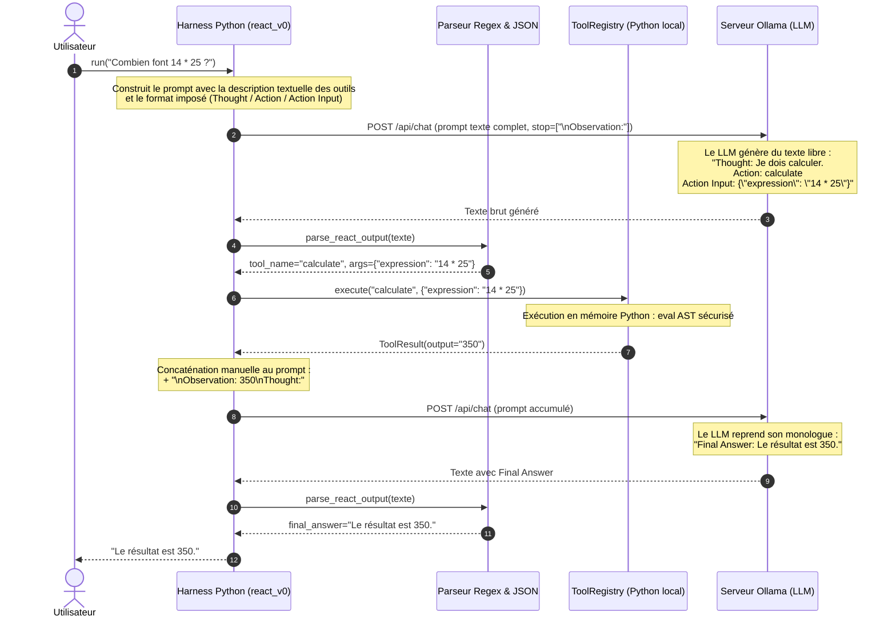
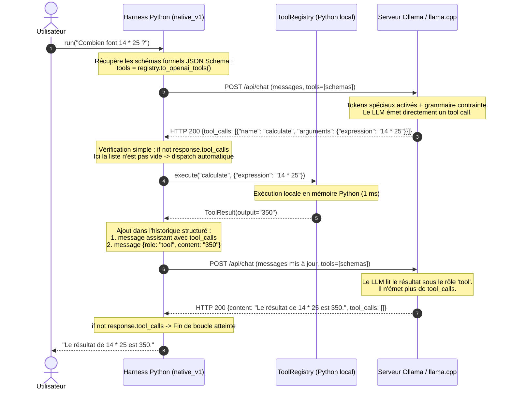
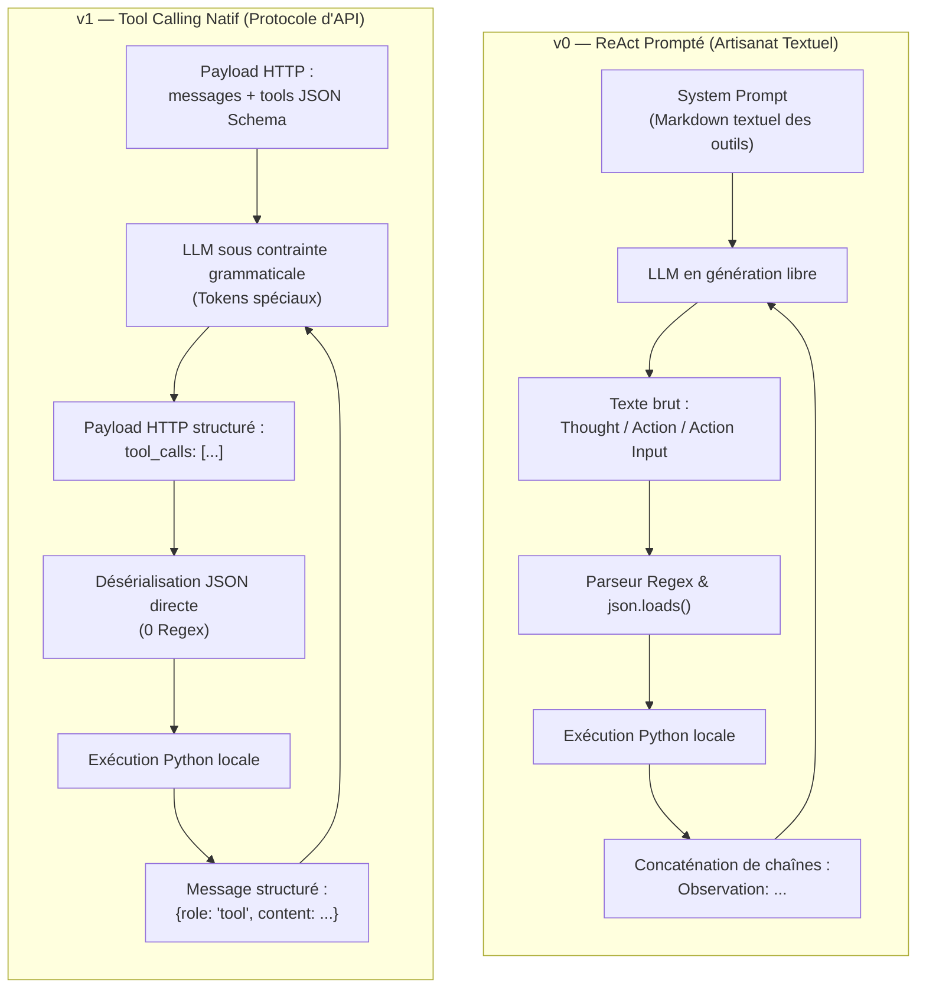

# Architecture & Flux d'Exécution : Comparatif v0 vs v1

Ce document synthétise les différences architecturales et mécaniques entre l'approche **v0 (ReAct par Prompting Textuel)** et l'approche **v1 (Tool Calling Natif d'API)**.

---

## 1. Principe Fondamental : Qui Fait Quoi ?

Avant d'examiner les flux, rappelons la frontière d'exécution :
* **Le LLM (Ollama) :** Est un système *stateless* (sans état) qui génère des tokens probables. Il n'a **aucun terminal**, aucun accès réseau direct, et ne peut exécuter aucune ligne de code.
* **Le Harness (notre script Python local) :** Est le moteur exécutif. Il détient les fonctions Python réelles ([`clock.py`](file:///Users/jeanvangysel/code/website/harness_tools/src/harness_tools/tools/clock.py), [`calculator.py`](file:///Users/jeanvangysel/code/website/harness_tools/src/harness_tools/tools/calculator.py)), appelle l'API d'Ollama, valide les données, exécute les calculs en mémoire et réinjecte l'information.

---

## 2. Diagramme de Séquence : v0 (ReAct Prompté)

Dans la version v0 ([`react_v0.py`](file:///Users/jeanvangysel/code/website/harness_tools/src/harness_tools/harness/react_v0.py)), tout repose sur du **texte brut** et du **parsing par expressions régulières (Regex)**.

### Vulnérabilités & Coûts de la v0 :
1. **Fragilité syntaxique (*Parsing Hell*) :** Si le LLM oublie un guillemet, modifie la casse (`action:` au lieu de `Action:`), ou ajoute du bavardage, la regex échoue.
2. **Besoin de *Stop Sequences* :** Nécessité absolue de couper la génération (`\nObservation:`) pour empêcher le LLM d'inventer lui-même une fausse observation.
3. **Surcoût en tokens & latence :** Génération forcée de monologues verbeux ralentissant l'inférence (jusqu'à 7× plus lent sur petit modèle).

---

## 3. Diagramme de Séquence : v1 (Tool Calling Natif)

Dans la version v1 ([`native_v1.py`](file:///Users/jeanvangysel/code/website/harness_tools/src/harness_tools/harness/native_v1.py)), les outils sont déclarés via le paramètre officiel `tools` de l'API HTTP, et le modèle répond avec des structures de données typées.

---

## 4. Comparatif Architectural Synthétique

---

## 5. Synthèse des Différences

| Dimension | v0 — ReAct Textuel | v1 — Tool Calling Natif |
|---|---|---|
| **Canal de déclaration** | Texte libre dans le `system_prompt` | Paramètre API HTTP officiel `tools: [...]` |
| **Spécification des outils** | Chaînes formatées à la main | Schémas formels **JSON Schema** standardisés |
| **Expression de l'intention** | Texte simulé (`Action: foo`) | Tableau d'objets `tool_calls` |
| **Mécanisme de capture** | Expressions régulières ([`re.search`](https://docs.python.org/3/library/re.html#re.search)) | Champ de réponse HTTP déjà désérialisé |
| **Garantie syntaxique** | Faible (dépend du respect des consignes) | Élevée (grammaires de décodage côté moteur d'inférence) |
| **Réinjection de la donnée** | Concaténation textuelle (`\nObservation: ...`) | Rôle sémantique dédié `{role: "tool"}` |
| **Latence observée (4B)** | Élevée (verbiage et monologues intermédiaires) | Optimale (émissions compactes et directes) |
