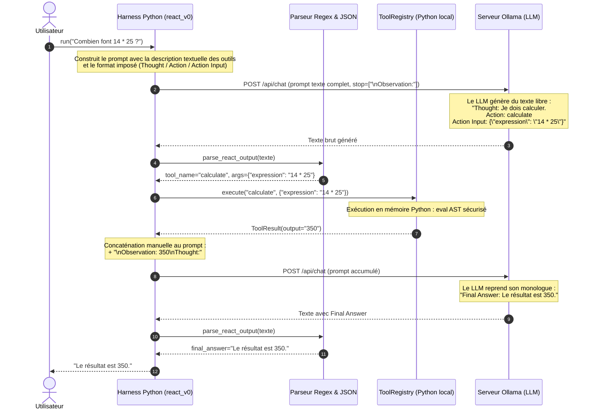
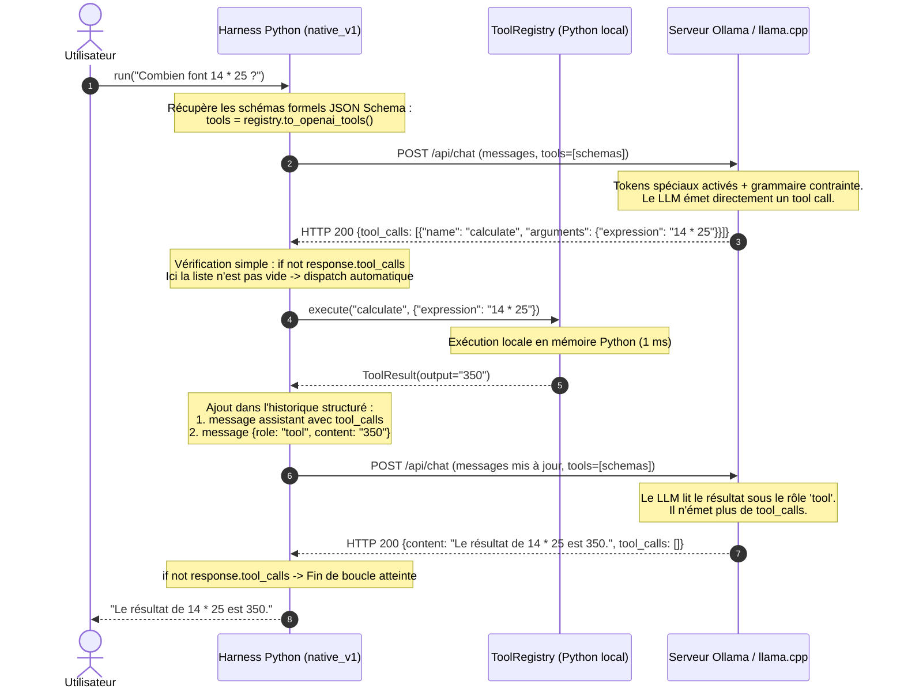
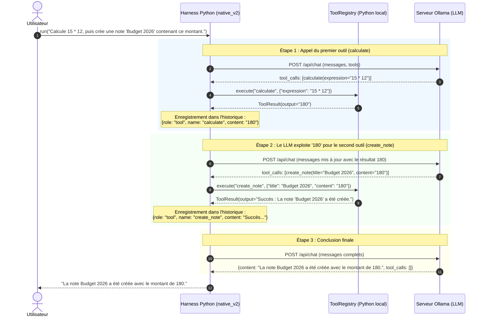
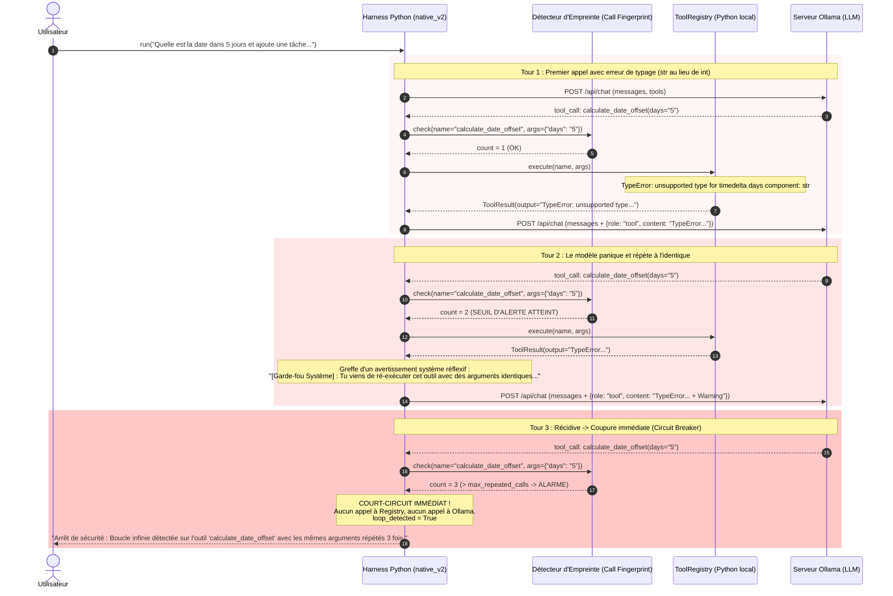
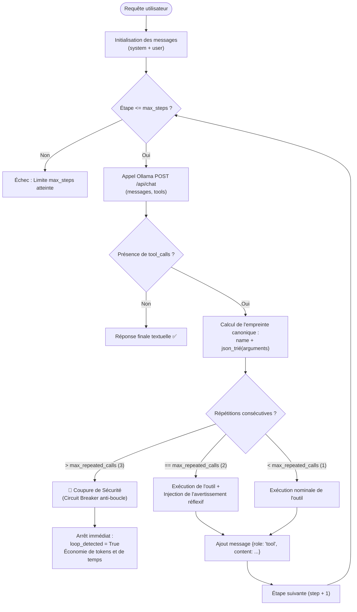

# Architecture & Flux d'Exécution : De v0 à v2

Ce document synthétise les différences architecturales et mécaniques entre l'approche **v0 (ReAct par Prompting Textuel)**, l'approche **v1 (Tool Calling Natif d'API)** et l'approche **v2 (Enchaînement Multi-Étapes & Garde-Fous Anti-Boucle)**.

---

## 1. Principe Fondamental : Qui Fait Quoi ?

Avant d'examiner les flux, rappelons la frontière d'exécution :
* **Le LLM (Ollama) :** Est un système *stateless* (sans état) qui génère des tokens probables. Il n'a **aucun terminal**, aucun accès réseau direct, et ne peut exécuter aucune ligne de code.
* **Le Harness (notre runtime Python local) :** Est le moteur exécutif. Il détient les fonctions Python réelles ([`clock.py`](file:///Users/jeanvangysel/code/website/harness_tools/src/harness_tools/tools/clock.py), [`calculator.py`](file:///Users/jeanvangysel/code/website/harness_tools/src/harness_tools/tools/calculator.py), [`notes.py`](file:///Users/jeanvangysel/code/website/harness_tools/src/harness_tools/tools/notes.py), [`todo.py`](file:///Users/jeanvangysel/code/website/harness_tools/src/harness_tools/tools/todo.py)), appelle l'API d'Ollama, valide les données, exécute les calculs en mémoire et réinjecte l'information.

---

## 2. Diagramme de Séquence : v0 (ReAct Prompté)

Dans la version v0 ([`react_v0.py`](file:///Users/jeanvangysel/code/website/harness_tools/src/harness_tools/harness/react_v0.py)), tout repose sur du **texte brut** et du **parsing par expressions régulières (Regex)**.

### Vulnérabilités & Coûts de la v0 :
1. **Fragilité syntaxique (*Parsing Hell*) :** Si le LLM oublie un guillemet, modifie la casse (`action:` au lieu de `Action:`), ou ajoute du bavardage, la regex échoue.
2. **Besoin de *Stop Sequences* :** Nécessité absolue de couper la génération (`\nObservation:`) pour empêcher le LLM d'inventer lui-même une fausse observation.
3. **Surcoût en tokens & latence :** Génération forcée de monologues verbeux ralentissant l'inférence (jusqu'à 7× plus lent sur petit modèle).

---

## 3. Diagramme de Séquence : v1 (Tool Calling Natif 1-Shot)

Dans la version v1 ([`native_v1.py`](file:///Users/jeanvangysel/code/website/harness_tools/src/harness_tools/harness/native_v1.py)), les outils sont déclarés via le paramètre officiel `tools` de l'API HTTP, et le modèle répond avec des structures de données typées.

---

## 4. Diagramme de Séquence : v2 (Chaînage Multi-Étapes & Passage de Données)

Dans la version v2 ([`native_v2.py`](file:///Users/jeanvangysel/code/website/harness_tools/src/harness_tools/harness/native_v2.py)), le harness orchestre des **trajectoires séquentielles** où le résultat d'un premier outil est réinjecté pour alimenter les paramètres d'un second outil.

---

## 5. Diagramme de Séquence : v2 (Mécanisme Anti-Boucle Infinie)

Lorsqu'un LLM fait face à une erreur ou une réponse inattendue, il a tendance à s'enfermer dans un **attracteur auto-régressif** et à ré-exécuter le même appel identique à l'infini.

Voici comment le **Garde-Fou v2 (*Loop Guard*)** intercepte cette anomalie (constatée en direct sur `calculate_date_offset(days="5")`) :

---

## 6. Machine à États de l'Harness v2 (Flowchart)

---

## 7. Synthèse Comparative des 3 Versions

| Dimension | v0 — ReAct Textuel | v1 — Tool Calling Natif | v2 — Multi-Étapes & Garde-Fous |
|---|---|---|---|
| **Protocole d'échange** | Texte libre + Regex | API `tools: [...]` + grammaires JSON | API `tools: [...]` + grammaires JSON |
| **Type de trajectoire** | 1 action basique | 1 action optimisée | **Multi-actions en cascade** (donnée $T_1 \to T_2$) |
| **Garde-fou de boucle** | Aucun (bloqué au `max_steps`) | Aucun (bloqué au `max_steps`) | **Détecteur d'empreinte canonique + Circuit Breaker** |
| **Gestion des répétitions** | Aveugle | Aveugle | **Avertissement réflexif à $N=2$, coupure à $N=3$** |
| **Latence moyenne (4B)** | Très lente (17s à 62s) | Très rapide (8s à 13s) | Contrôlée (arrêt précoce en cas de dérive) |
| **Persistance mémoire** | Simulée en texte | En mémoire | Validée sur états réels (`notes`, `todo`) |
