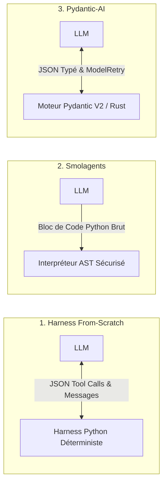
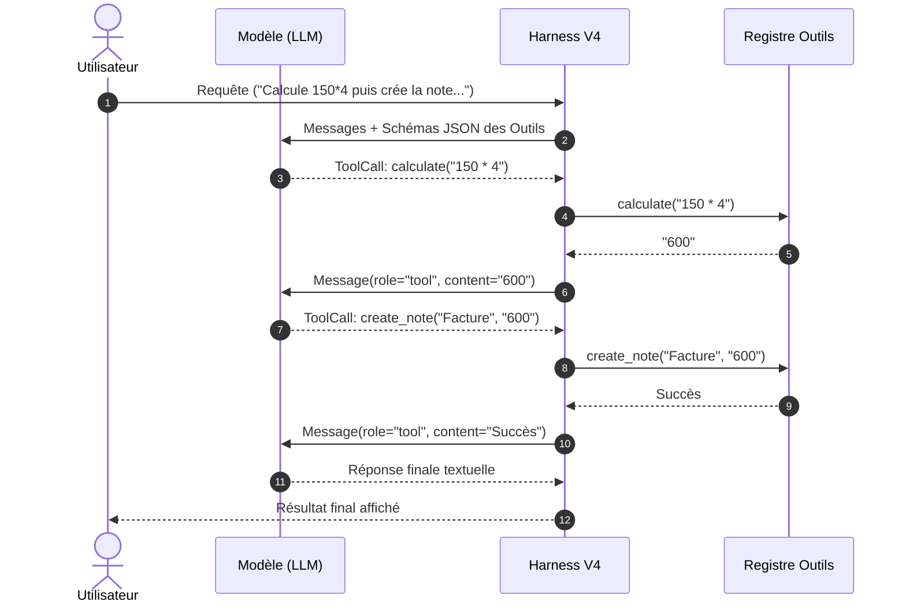
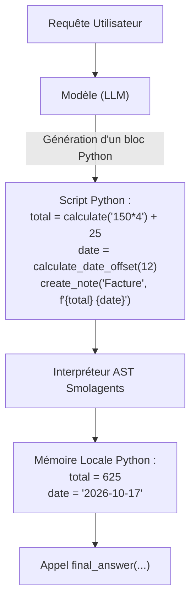
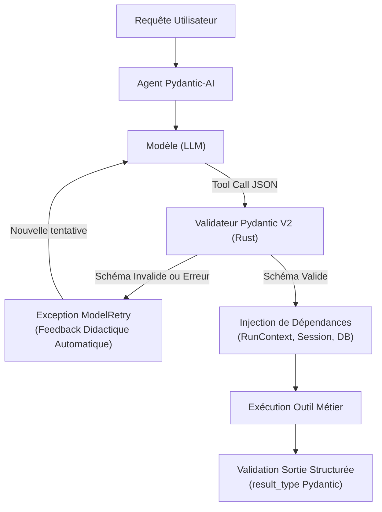

# Étape 9 (partie 1) : Comparatif Conceptuel, Harness From-Scratch vs Smolagents vs Pydantic-AI

Ce document consigne les fondements théoriques, les flux d'exécution et les compromis d'ingénierie entre notre **Harness V4 construit de zéro** et les deux frameworks majeurs de l'écosystème : **Smolagents (Hugging Face)** et **Pydantic-AI**.

---

## 1. Vue d'Ensemble Macro : 3 Philosophies d'Interaction

---

## 2. Analyse Détaillée des 3 Paradigmes

### A. Notre Harness From-Scratch : *« JSON Protocol & Explicit Loop »*

L'agent est une **boucle d'allers-retours de messages typés** (`system`, `user`, `assistant`, `tool`). Le modèle n'exécute aucun code : il formule son intention sous forme d'un objet JSON strict, et le runtime Python l'exécute pas à pas.

* **Forces Majeures :**
  - **Zéro dépendance externe** : Standard library Python pure (`inspect`, `json`, `dataclasses`).
  - **Transparence absolue** : Chaque token, chaque message et chaque état mémoire sont sous contrôle total.
  - **Contrôle Human-in-the-Loop (HITL) chirurgical** : Interception déterministe pré-exécution par niveau de risque (`read`, `write`, `destructive`).
  - **Sécurité maximale** : Aucune exécution de code dynamique.

* **Limites & Pièges (révélés par le benchmark) :**
  - **Composition de données laborieuse** : Le passage de variables (`x = f() ; g(x)`) impose des allers-retours réseau complets.
  - **Parallel Tool Calling halluciné** : Les modèles 3B ont tendance à émettre tous les outils d'un coup sans attendre les résultats intermédiaires.

---

### B. Smolagents (Hugging Face) : *« The Code Agent Paradigm »*

Smolagents abandonne le JSON Tool Calling : le modèle **rédige directement un script Python** qui est évalué localement dans un bac à sable AST.

* **Forces Majeures :**
  - **Résolution native des dépendances** : Les variables locales vivent dans la mémoire Python du script ; le piège de `stress_long_chain_4step` disparaît.
  - **Turn Count minimal** : Les opérations complexes (boucles `for`, filtres conditionnels) s'exécutent en un seul tour de génération.
  - **Expressivité algorithmique** : Utilisation naturelle de la syntaxe Python.

* **Compromis & Risques :**
  - **Surface d'attaque & Sécurité (Sandbox escape)** : Exécuter du code généré par un LLM impose un bac à sable rigoureux.
  - **HITL difficile à orchestrer** : Interrompre un script Python à mi-parcours pour une confirmation humaine est complexe.
  - **Fragilité syntaxique** : Une simple faute de frappe du LLM provoque un crash `SyntaxError`.

---

### C. Pydantic-AI : *« Type-Driven & Model-Validated Agents »*

Pydantic-AI conserve le Tool Calling JSON mais le renforce avec la rigueur industrielle de **Pydantic V2** (moteur Rust) et l'injection de dépendances.

* **Forces Majeures :**
  - **Auto-correction native (`ModelRetry`)** : En cas d'erreur de typage ou de paramètre, un feedback d'auto-correction est réinjecté sans code ad hoc.
  - **Sorties Structurées Garanties (`result_type`)** : Formatage final contraint par un modèle Pydantic strict.
  - **Injection de Dépendances Typées (`RunContext`)** : Architecture propre pour la production (bases de données, sessions utilisateurs).

* **Compromis & Risques :**
  - **Mêmes contraintes de granularité que le Tool Calling standard** : Chaque étape dépendante nécessite un aller-retour réseau complet.
  - **Complexité de l'API** : Manipulation verbeuse des génériques et des types contextuels.

---

## 3. Matrice Comparative Synthétique

| Critère | Notre Harness Maison (V4) | Smolagents (Code Agent) | Pydantic-AI (Type-Driven) |
| :--- | :--- | :--- | :--- |
| **Philosophie** | Pédagogie & Transparence | Code First (Python AST) | Type-Safety & Production |
| **Format d'interaction LLM** | Payloads JSON (OpenAI Tools) | Script Python brut exécutable | Payloads JSON validés Pydantic |
| **Gestion des variables locales** | Allers-retours d'historique | Variables en mémoire Python | Allers-retours d'historique |
| **Sécurité d'exécution** | Maximale (fonctions isolées) | Vigilance requise (AST Sandbox) | Maximale (fonctions isolées) |
| **Mécanisme d'auto-correction** | Didactic Feedback textuel | Traceback d'erreur Python | Exception native `ModelRetry` |
| **Contrôle Humain (HITL)** | Intégré par criticité (`RiskLevel`) | Complexe en flux continu AST | Prévu via orchestration/approbation |
| **Sorties garanties** | Formatage textuel libre | Valeur de retour du script | Modèle Pydantic strict (`result_type`) |
| **Empreinte logicielle** | **0 dépendance** (std lib pure) | Écosystème Hugging Face | Pydantic V2 + HTTPX |

---

## 4. Hypothèses à Valider sur le Benchmark Commun (19 Cas)

Lors de la prochaine étape d'expérimentation, les 3 runtimes seront exécutés sur le même modèle (`qwen2.5:3b`) et le même jeu de données ([`get_full_eval_dataset()`](../src/harness_tools/eval/dataset.py#L233)) :

1. **`stress_long_chain_4step`** : Smolagents devrait résoudre nativement ce cas en 1 seule passe de code, là où notre harness et Pydantic-AI nécessitent plusieurs tours séquentiels.
2. **`trap_selective_deletion`** : Le système de `ModelRetry` de Pydantic-AI permettra-t-il à un modèle 3B de corriger son titre erroné avant de capituler ?
3. **`trap_prompt_injection`** : Smolagents et son interpréteur Python résisteront-ils aussi bien à l'injection indirecte que notre harness JSON ?
